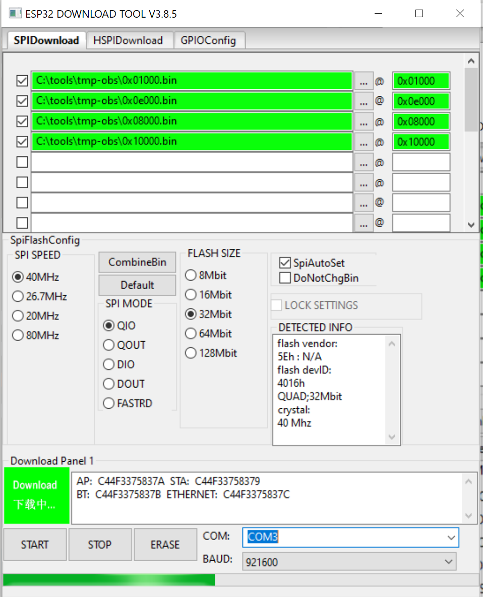

# Initial ESP flashing

You can always use an IDE setup to flash the ESP but if you simply 
want to start using the OBS this way might be more straight forward. 

As of today, this thing is foe Windows only.

Other than for the next updates that you can do over the air using 
the small release package, you need the "initial flash" zip file, and 
the _Flash Download Tools_ from
[ESPRESSIF](https://www.espressif.com/en/support/download/other-tools?keys=&field_type_tid%5B%5D=13)

## Preparation

Download the latest release archive from 
[OpenBikeSensorFirmware at GITHub](https://github.com/openbikesensor/OpenBikeSensorFirmware/releases). 
You need the larger ZIP file named `obs-v9.9.9999-initial-flash.zip`.
Extract the files in a temporary folder, they are named like 
0x??????.bin. The numbers are the base address where the data should 
be flashed. Don`t worry this will make sense in the next steps.

Please download _Flash Download Tools (ESP8266 & ESP32 & ESP32-S2)_ from
[ESPRESSIF](https://www.espressif.com/en/support/download/other-tools?keys=&field_type_tid%5B%5D=13)
and extract the tool also in a dedicated temporary folder. There
will be no install step, the tool is started directly in the folder.

Remove USB devices from your computer, that you do not need right now.
They can be confused during the selection of the right device to be
flashed.

## Steps

You likely need to install a so called USB 2 UART (serial) driver 
for so that your Windows can communicate with the chip on the 
ESP development board. Since it is a generic driver, you might 
already have one installed from other projects?
If in doubt please download and install the driver 1st from the 
manufacturers page, Silicon Labs. It might also be worth to update 
to the latest version. The driver is in the package for the 
CP210x chips. As the time of writen the download is at 
https://www.silabs.com/developers/usb-to-uart-bridge-vcp-drivers  
and called "CP210x Universal Windows Driver". Follow the 
instructions given there. If the link does not work use Google 
to get a updated version but as usual pay attention that you end
on a trustworthy page.

Now connect ESP via USB. Windows should confirm that a new
device was detected. 

Start `flash_download_tool_3.X.X.exe`, in the folder of the _Flash 
Download Tool_. Give it some time to start. It will open a console 
window 1st and eventually a simple UI. 

Choose `Developer Mode` - `ESP32 DownloadTool` in the UI. The 
`Factory Mode` can be used if you need to flash a whole batch of 
ESPs. In that case you can also connect multiple ESPs at the same 
time.

Now we need to tell the tool what needs to be flashed. At the
top of the dialog you now see several lines starting, with 
checkboxes, a textarea, 3 dots an `@` sign and one more
text ara.

For each of the 4 files we need to flash, select the 3 dots which
will bring up a file selector where you need to choose one of
the 4 *.bin files. The order is not important, but you need to 
enter the _address_ of the file in the 2nd text field. The _address_ 
is the same as the filename `0x10000` for example. The boxes get
a green background confirming a positive sanity check of the flash 
tool.

Now select the checkboxes in front of the entries you just made.

All other values stay with the default:
`SPI SPEED` : `40MHz`, `SPI MODE` : `DIO` (This one will change 
automatically in a moment), `FLASH SIZE` : `32Mbit` and finally
`SpiAutoSet` : `selected`, `DoNotChgBin` : `not selected`.

On the button you see a drop-down box `COM:` here you have to 
select the correct com post for the flash process. If unsure
leave the default and try a different value if the process 
fails. Make sure you have no other devices connected!

Press: "START".

You should see something like this now:

If all goes correct, you should see a progress bar with final 
success message. Unplug the USB cable. The ESP is then ready 
to be placed inside the OBS housing (if not done already).
Thanks to OTA Update you should not need to update this way
anymore.

If you get some _red_ error feedback, check that the USB 
connection is correct and that the right COM port was selected.
If all fails, use the OBS Slack to get some help.
Currently, there is not much troubleshooting info collected, 
but this will change.

Now you can continue at the user documentation at 
[OBS - User Guide - Configuration](https://www.openbikesensor.org/user-guide/configuration.html).

## Licenses

https://docs.espressif.com/projects/esp-idf/en/latest/esp32/COPYRIGHT.html

TODO
